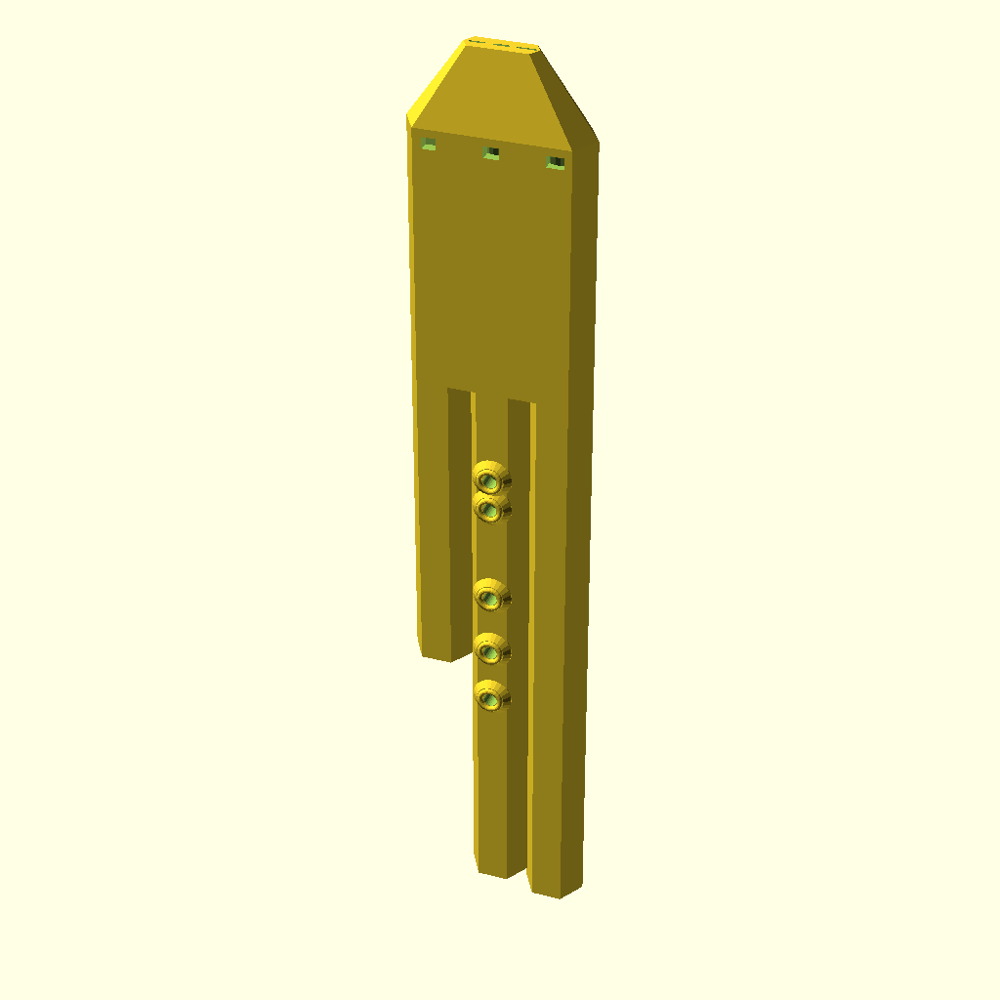

# 🪈 Native American Triple Flute (A4) with Slow Air Chamber (SAC)

Traditional Native American minor pentatonic triple flute in A4 featuring an internal Slow Air Chamber (SAC) expansion reservoir that smooths breath pressure and produces a warm, velvety acoustic tone with rich drone resonance.

---

## 📸 3D Renderings

| Full Assembly View | Mouthpiece & Beak Detail |
|:---:|:---:|
|  |  |

---

## 🎧 Audio & MIDI Preview

- 🔊 **Audio Recording (WAV)**: [flute.wav](flute.wav)
- 🎼 **MIDI Sequence**: [flute.mid](flute.mid)
- 📐 **Parametric OpenSCAD Model**: [flute.scad](flute.scad)
- 🖨️ **3D Printable STL**: [flute.stl](flute.stl)

> [!TIP]
> Open [`index.html`](index.html) in your web browser for an interactive 3D rotating model viewer with embedded audio playback!

---

## 📐 Acoustic & CAD Specifications

- **Root Note**: MIDI 69
- **Musical Scale**: `native_american`
- **Melody Preset**: `native_motif`
- **Mouthpiece Profile**: `sac`
- **Windway Texture**: `smooth`
- **Drone Air Balancing Ratio**: `0.78`
- **Total Height**: 389.6 mm
- **Melody Tube Length**: 359.6 mm (440.0 Hz)
- **Drone 1 Tube Length**: 354.8 mm (440.0 Hz)
- **Drone 2 Tube Length**: 234.7 mm (659.3 Hz)
- **Tone Holes**: 5 holes (297.5mm, 261.8mm, 229.9mm, 188.5mm, 164.6mm)
