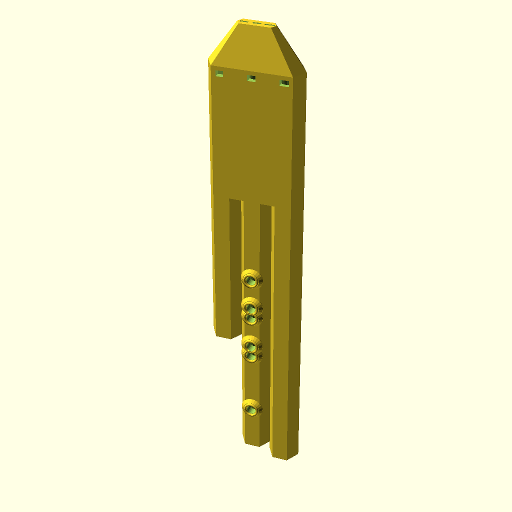
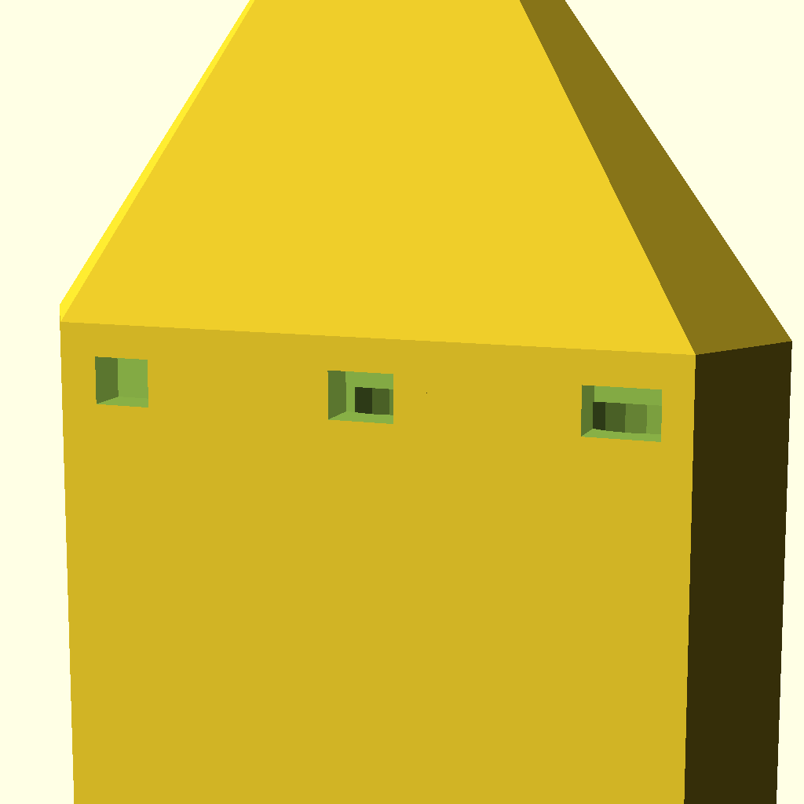

# 🪈 Desert Caravan Middle Eastern Flute (A4) with Venturi Windway

Middle Eastern Hijaz scale flute in A4 with a Venturi accelerating windway, which raises jet velocity at the labium for crisp octave voicing over the drone backdrop.

---

## 📸 3D Renderings

| Full Assembly View | Mouthpiece & Beak Detail |
|:---:|:---:|
|  |  |

---

## 🎧 Audio & MIDI Preview

- 🔊 **Audio Recording (WAV)**: [flute.wav](flute.wav)
- 🎼 **MIDI Sequence**: [flute.mid](flute.mid)
- 📐 **Parametric OpenSCAD Model**: [flute.scad](flute.scad)
- 🖨️ **3D Printable STL**: [flute.stl](flute.stl)

> [!TIP]
> Open [`index.html`](index.html) in your web browser for an interactive 3D rotating model viewer with embedded audio playback!

The `.wav` is rendered through the studio's own digital waveguide AudioWorklet and its
convolution room reverb, so it is the signal the studio plays for these settings, not a
separate model of it.

---

## 📐 Acoustic & CAD Specifications

- **Root Note**: MIDI 69
- **Musical Scale**: `hijaz`
- **Melody Preset**: `desert_caravan`
- **Mouthpiece Profile**: `venturi`
- **Drone Intervals**: 0 and 7 semitones from the root
- **Total Height**: 451.0 mm
- **Melody Tube Length**: 370.5 mm (440.0 Hz)
- **Drone 1 Tube Length**: 379.0 mm (440.0 Hz)
- **Drone 2 Tube Length**: 251.7 mm (659.3 Hz)
- **Tone Holes**: 6 holes of 8.5 mm, measured from the fipple (333.5mm, 271.5mm, 261.0mm, 230.1mm, 219.6mm, 190.4mm)
- **Tuning Residual**: worst 11.8 cents across the solved lattice
- **Tuning Notice**: 8.5 mm holes: 4 of 7 target pitches are out of reach at any hole position; worst 11.8 cents off.
