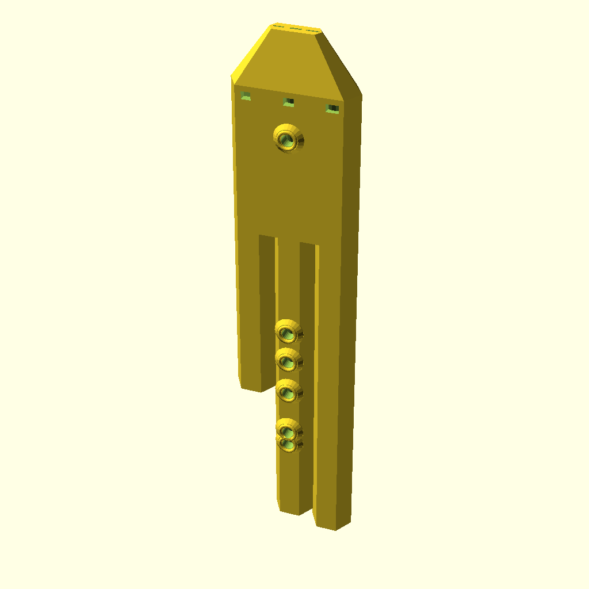
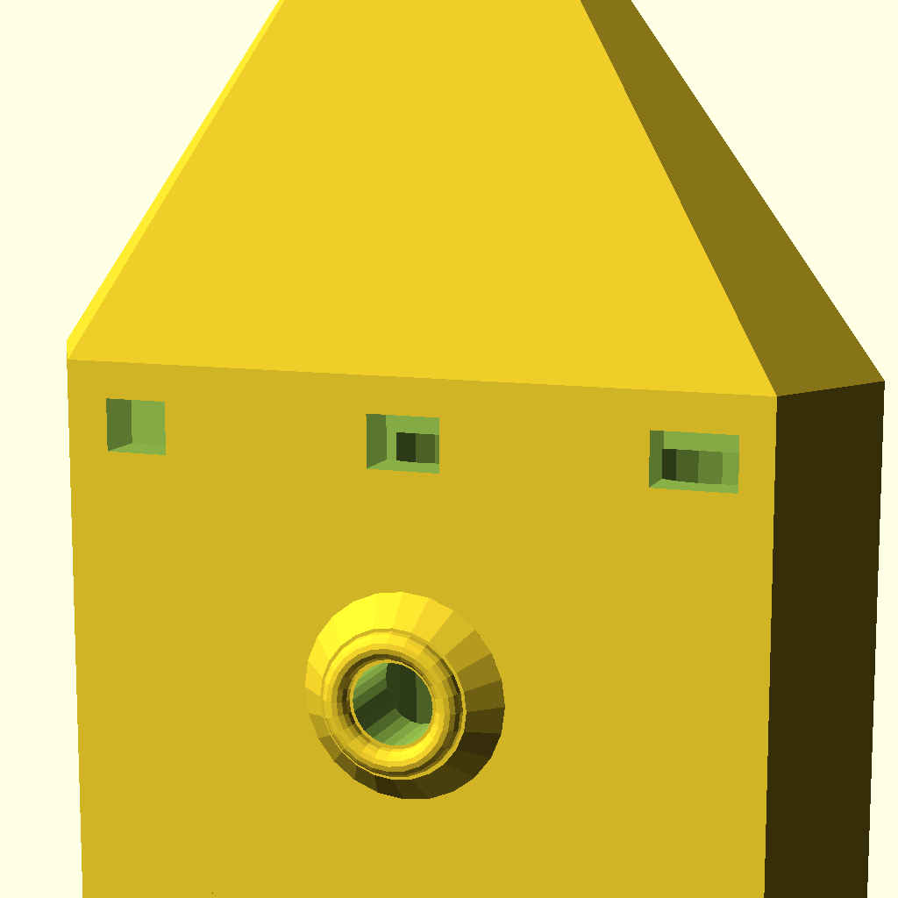

# 🪈 Renaissance Greensleeves Triple Flute (C5) in Dorian Scale

High-register C5 triple flute in Dorian modal scale playing Greensleeves with crisp planar windway voicing and a calibrated harmonic fifth drone accompaniment.

---

## 📸 3D Renderings

| Full Assembly View | Mouthpiece & Beak Detail |
|:---:|:---:|
|  |  |

---

## 🎧 Audio & MIDI Preview

- 🔊 **Audio Recording (WAV)**: [flute.wav](flute.wav)
- 🎼 **MIDI Sequence**: [flute.mid](flute.mid)
- 📐 **Parametric OpenSCAD Model**: [flute.scad](flute.scad)
- 🖨️ **3D Printable STL**: [flute.stl](flute.stl)

> [!TIP]
> Open [`index.html`](index.html) in your web browser for an interactive 3D rotating model viewer with embedded audio playback!

The `.wav` is rendered through the studio's own digital waveguide AudioWorklet and its
convolution room reverb, so it is the signal the studio plays for these settings, not a
separate model of it.

---

## 📐 Acoustic & CAD Specifications

- **Root Note**: MIDI 72
- **Musical Scale**: `dorian`
- **Melody Preset**: `greensleeves`
- **Mouthpiece Profile**: `flat`
- **Drone Intervals**: 0 and 7 semitones from the root
- **Total Height**: 388.9 mm
- **Melody Tube Length**: 311.0 mm (523.3 Hz)
- **Drone 1 Tube Length**: 316.9 mm (523.3 Hz)
- **Drone 2 Tube Length**: 210.3 mm (784.0 Hz)
- **Tone Holes**: 6 holes of 8.0 mm, measured from the fipple (254.8mm, 244.8mm, 212.2mm, 187.0mm, 164.4mm, 24.2mm)
- **Tuning Residual**: worst 5.1 cents across the solved lattice
- **Tuning Notice**: 8.0 mm holes: 2 of 7 target pitches are out of reach at any hole position; worst 5.1 cents off.
